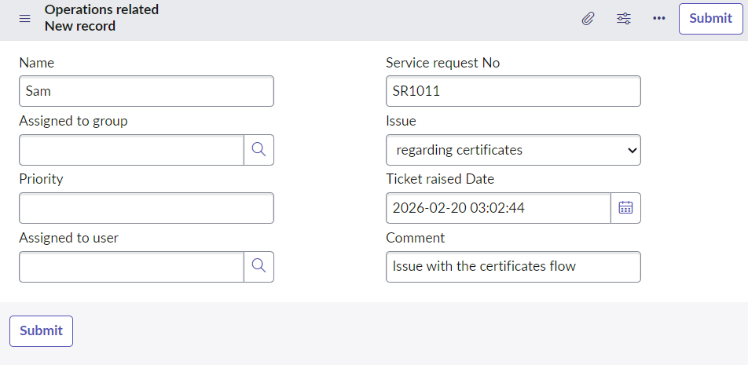
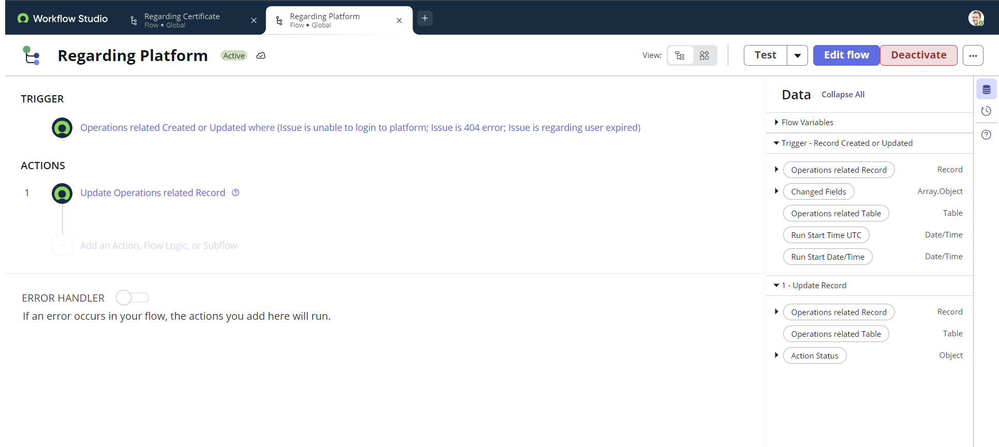

# 📸 Project Screenshots

This folder contains key screenshots demonstrating the working of the ServiceNow Ticket Assignment Automation project.

---

## 🔹 1. Ticket Creation (Input)

Shows creation of a new Operations Related ticket where the issue type is selected.

---

## 🔹 2. Certificate Flow Automation

Flow Designer automation that assigns tickets to the **Certificate Group** when issue = Regarding Certificates.

---

## 🔹 3. Platform Flow Automation

Flow Designer automation that assigns tickets to the **Platform Group** for platform-related issues.

---

## 🔹 4. Final Output (Auto Assignment Result)

Shows the final result where tickets are automatically assigned to the correct group.

.png)

---

✔ These screenshots represent the complete workflow:

Input → Automation → Output
